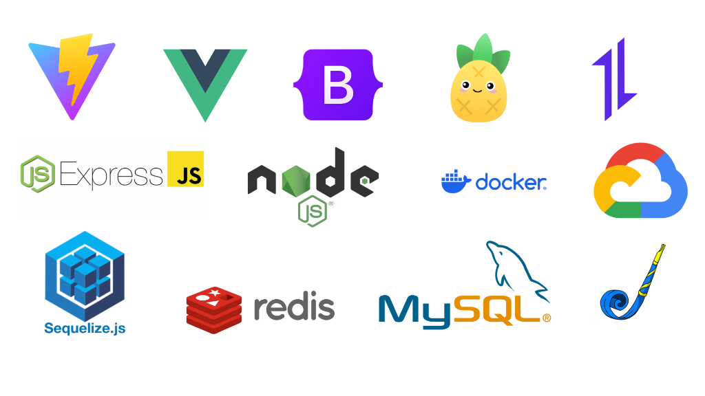

# ระบบจัดการการเรียนรู้ (LMS)

## 🔎 หมายเหตุ (Disclosure)
Repository นี้ถูกพัฒนาขึ้นในลักษณะ **Mock / Representative Project** เพื่อใช้แสดงแนวคิดเชิงสถาปัตยกรรม กระบวนการออกแบบระบบ 
โค้ดและเอกสารในโปรเจกต์นี้ **ไม่ได้ถูกพัฒนาขึ้นเพื่อตอบสนองความต้องการของระบบใดระบบหนึ่งโดยตรง**

## 📌 ภาพรวมโปรเจกต์ (Project Overview)
ระบบจัดการการเรียนรู้ (Learning Management System: LMS) ฝั่งเซิร์ฟเวอร์ ที่พัฒนาขึ้นเพื่อใช้เป็น **ตัวแทนเชิงเทคนิคของระบบภายในองค์กร (Internal System)**  
มุ่งเน้นการออกแบบโครงสร้างระบบที่ปลอดภัย ดูแลรักษาง่าย และรองรับการขยายในระยะยาว

โปรเจกต์นี้เน้นการจัดการสิทธิ์การเข้าถึงด้วย **Role-Based Access Control (RBAC)** เพื่อแยกขอบเขตความรับผิดชอบของผู้ใช้งานแต่ละบทบาทอย่างชัดเจน พร้อมแนวคิดด้านการตรวจสอบการทำงาน (Auditability) และการจัดการข้อมูลในบริบทของระบบองค์กร

---

## เอกสารประกอบ (Documentation)
เพื่อให้เข้าใจระบบในแต่ละส่วนได้ดียิ่งขึ้น กรุณาศึกษาเอกสารฉบับแยกตามหัวข้อดังนี้:

*   **[📜 ROLE.md](./ROLE.md)**: รายละเอียดบทบาทและสิทธิ์การเข้าถึงของผู้ใช้งาน (Admin, Instructor, Learner)
*   **[✨ FEATURES.md](./FEATURES.md)**: รวมฟีเจอร์และความสามารถหลักของระบบ
*   **[🛡️ SECURITY.md](./SECURITY.md)**: มาตรการความปลอดภัย, การจัดการ Authentication, Token, และ Audit Logs

---

## 🛠 เทคโนโลยีที่ใช้ (Tech Stack)

### Backend (Server)
*   **Runtime**: Node.js
*   **Framework**: Express.js
*   **Database**: MySQL (Sequelize ORM)
*   **Authentication**: JWT, Google Auth Library
*   **Caching**: Redis
*   **Validation**: Joi

### Frontend (Client)
*   **Framework**: Vue 3 (Composition API)
*   **Build Tool**: Vite
*   **State Management**: Pinia
*   **UI Library**: Bootstrap 5
*   **HTTP Client**: Axios
